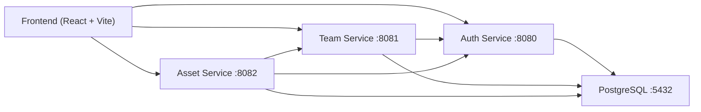

# Seta Golang Intern Mini Project

## Introduction

This repository contains a multi-service system for the 2026 Golang Internship Capstone.  
The product domain is **User, Team, and Asset Management**:

- Users can register/login and are assigned roles (`manager` or `member`)
- Managers can create teams and manage memberships
- Users can manage folders/notes and share assets with read/write permissions

The project is intentionally developed in stages. The codebase currently includes:

- Stage 1 foundation (Auth/User + Team services)  
- Stage 2 Service 1 (Asset Management & Sharing)  
- Stage 2 Service 2 (`POST /import-users` concurrency challenge) is **not implemented yet**
- Stage 3 is **not implemented yet**

## Tech Stack


This project uses a practical stack centered on **Go + Gin + GORM + PostgreSQL + React + Vite + Docker Compose**. The core reason is not trend alignment; it is execution speed with clean boundaries for an internship capstone that must show architecture thinking, API discipline, and incremental delivery.

On the backend, Go is a strong fit because each service is network-heavy and mostly I/O-bound rather than CPU-bound. Go gives lightweight concurrency primitives, good performance, and a simple deployment model. Compared with Node.js, Go avoids runtime-level event loop bottlenecks for some workloads and provides stronger compile-time guarantees. Compared with Java/Spring, Go reduces framework complexity and startup overhead, which helps when you run multiple services locally during development and demos.

For HTTP, this project uses Gin. The choice favors predictable route/middleware handling and quick bootstrap for service-oriented REST APIs. A raw `net/http` setup would be lighter, but would require more repetitive plumbing for binding, validation, and structured handlers. Heavier frameworks could offer more batteries included, but would slow iteration and add cognitive load for an educational project.

Database access uses GORM with PostgreSQL. PostgreSQL is selected because the domain needs transactional consistency (sessions, memberships, ownership, shares, revoke flows), rich indexing options, and mature tooling. A NoSQL store could simplify some document-like parts, but would complicate relational checks such as ownership + sharing + team oversight in one permission flow. GORM is a trade-off: it speeds up CRUD and migration work through model-driven code, but can hide SQL complexity. For this stage, faster iteration is more valuable than hand-optimized SQL everywhere. Where needed, repository boundaries keep room for future query tuning.

The API style is REST (JSON over HTTP). REST was chosen over GraphQL and gRPC for stage pragmatism. GraphQL is powerful for client-driven querying, but introduces schema tooling and resolver complexity that does not materially improve this project’s early phases. gRPC gives excellent typed contracts and performance, but adds additional proto/tooling overhead and less browser-native ergonomics. REST keeps onboarding and debugging straightforward with curl/Postman while still allowing clear service contracts.

Frontend uses React + React Router + Vite. React is already a standard choice for role-based UI flows and stateful forms. Vite keeps startup fast and configuration small, which matters when frontend is only one part of a larger multi-service workflow. A full framework (for example Next.js) would provide extra features (SSR, file-system routing), but those are not core requirements for this backend-focused capstone.

For environment orchestration, Docker Compose is used alongside local process scripts. Compose gives consistent multi-service startup (`db`, `auth`, `team`, `asset`, `frontend`) and lower setup friction across machines. The trade-off is additional Dockerfile and hot-reload configuration overhead. To balance this, the project supports two paths: one-command local process startup (`npm run dev:all`) and one-command Compose startup (`npm run docker:up`).

A notable architecture decision is keeping service boundaries while still using one PostgreSQL instance in current stages. This is a pragmatic compromise: it keeps deployment simple and accelerates feature delivery. The downside is tighter coupling than an event-driven or fully isolated data-plane architecture. The code addresses this by preferring service-to-service calls for authorization context (for example token validation and relationship checks) instead of direct cross-service table ownership. This creates a cleaner migration path to stricter service isolation later.

In summary, the stack prioritizes **clarity, maintainability, and staged delivery** over maximal scalability patterns. It intentionally postpones heavier choices (message queue, event sourcing, service mesh, polyglot persistence) until they are justified by real bottlenecks, which is appropriate for the current milestone.

## Requirements

- Go `1.24+` (project modules currently target Go `1.26.2`)
- Node.js `18+`
- npm `9+`
- Docker Desktop (optional, for containerized startup)
- Root environment files:
  - `.env.backend`
  - `.env.frontend`

## Project Structure

```text
.
├─ frontend/
│  ├─ src/
│  │  ├─ api/
│  │  ├─ pages/
│  │  ├─ routes/
│  │  └─ context/
│  └─ README.md
├─ services/
│  ├─ auth-user-management-service/
│  ├─ team-management-service/
│  └─ asset-management-service/
├─ project requirement & instruction/
├─ docker-compose.yml
├─ package.json
└─ README.md
```

## Dependencies

Key workspace dependencies:

- Root tooling: `concurrently`
- Frontend: `react`, `react-dom`, `react-router-dom`, `vite`, `@vitejs/plugin-react`
- Backend services:
  - HTTP: `gin`
  - ORM/DB: `gorm`, `gorm postgres driver`
  - Config: `godotenv`
  - Auth/session helpers: `golang-jwt/jwt` (where applicable)
  - API docs: `swag`, `gin-swagger`, `swaggo/files` (Swagger UI per service)

## API Documentation

Each Go service ships **Swagger 2.0** specs and **Swagger UI** (via [swaggo/swag](https://github.com/swaggo/swag) and [gin-swagger](https://github.com/swaggo/gin-swagger)):

| Service | Swagger UI (default local) |
|--------|----------------------------|
| Auth | `http://localhost:8080/swagger/index.html` |
| Team | `http://localhost:8081/swagger/index.html` |
| Asset | `http://localhost:8082/swagger/index.html` |

Use **Authorize** in Swagger UI with a value like `Bearer <your_jwt>` (the APIs expect a `Bearer` prefix in the `Authorization` header).

Regenerate specs after changing handler comments (run from each service directory):

```powershell
go install github.com/swaggo/swag/cmd/swag@v1.16.4
cd services/auth-user-management-service
swag init -g main.go -o docs --parseInternal -d ./cmd,./internal/handler,./internal/usecase
```

Use the same `swag init` line in `team-management-service` and `asset-management-service` (module paths differ only by `cd`).

Service-level narrative API docs are also in each service README:

- [Auth User Management README](services/auth-user-management-service/README.md)
- [Team Management README](services/team-management-service/README.md)
- [Asset Management README](services/asset-management-service/README.md)

## Architecture Overview



## Service Catalog

- `auth-user-management-service` (`:8080`)  
  Registration, email verification, login/logout, user listing, session validation.
- `team-management-service` (`:8081`)  
  Team creation and member/manager management with role-based restrictions.
- `asset-management-service` (`:8082`)  
  Folder/note CRUD, sharing (read/write), folder inheritance, manager read-only oversight.
- `frontend` (`:5173`)  
  UI for auth, teams, and assets, using Vite proxy to backend APIs.

## Run and Development Guide

### Option A: Local One-Command Startup

```powershell
npm install
npm run dev:all
```

### Option B: Docker One-Command Startup (Dev Hot Reload)

```powershell
npm run docker:up
```

Useful Docker commands:

```powershell
npm run docker:logs
npm run docker:down
```

## Environment

### Backend (`.env.backend`)

Common keys used across services include:

- `DB_HOST`, `DB_PORT`, `DB_USER`, `DB_PASSWORD`, `DB_NAME`
- `PORT` (auth), `TEAM_SERVICE_PORT`, `ASSET_SERVICE_PORT`
- `JWT_SECRET`, `JWT_EXPIRES_HOURS`
- `APP_BASE_URL`
- `AUTH_SERVICE_URL`, `TEAM_SERVICE_URL`
- SMTP variables for email verification

### Frontend (`.env.frontend`)

- `VITE_API_BASE_URL`
- `VITE_TEAM_API_BASE_URL`
- `VITE_ASSET_API_BASE_URL`

## Current Status

- Stage 1 core foundation: implemented
- Stage 2 Service 1 (assets and sharing): implemented
- Stage 2 Service 2 (bulk CSV import with worker pool): pending
- Stage 3 scale/events scope: pending

This documentation reflects the current in-progress state of the internship project rather than a final production release.
