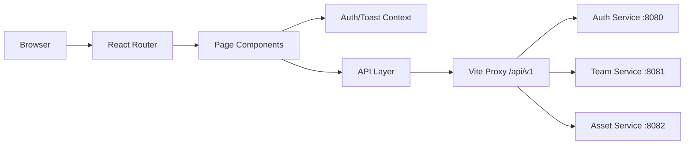

# Frontend (React)

## Introduction

This frontend is a React single-page application for the internship mini-project.  
It provides UI flows for:

- Authentication and email verification
- Team management
- Asset management and sharing

The app communicates with backend services through the Vite dev proxy under `/api/v1/*`.

## Tech Stack

- React 18
- React Router v6
- Vite 5
- JavaScript (ES modules)
- Fetch API with a shared request wrapper

## Requirements

- Node.js `18+`
- npm `9+`
- Root `.env.frontend` file
- Running backend services (`auth`, `team`, `asset`) for full feature coverage

## Project Structure

```text
frontend/
├─ src/
│  ├─ api/              # API clients per domain (auth, user, team, asset)
│  ├─ auth/             # token storage helpers
│  ├─ components/       # reusable UI components (navbar, toasts)
│  ├─ context/          # auth and toast providers
│  ├─ pages/            # route-level pages
│  ├─ routes/           # route guards (protected/manager)
│  ├─ utils/            # validators and helpers
│  ├─ App.jsx
│  └─ main.jsx
├─ index.html
├─ vite.config.js
└─ package.json
```

## Dependencies

Main runtime dependencies from [package.json](package.json):

- `react`
- `react-dom`
- `react-router-dom`

Main development dependencies:

- `vite`
- `@vitejs/plugin-react`

## API Documentation

The frontend calls these backend endpoint groups via proxy:

- Auth/User service:
  - `/api/v1/auth/*`
  - `/api/v1/users/*`
- Team service:
  - `/api/v1/teams/*`
- Asset service:
  - `/api/v1/folders/*`
  - `/api/v1/notes/*`
  - `/api/v1/shares/*`

Frontend domain API modules:

- `src/api/authApi.js`
- `src/api/userApi.js`
- `src/api/teamApi.js`
- `src/api/assetApi.js`

## Architecture Overview



## Run and Development Guide

From `frontend/`:

```powershell
npm install
npm run dev
```

Build production bundle:

```powershell
npm run build
```

Preview production bundle:

```powershell
npm run preview
```

You can also run everything from root with:

```powershell
npm run dev:all
```

## Environment

Expected keys in root `.env.frontend`:

- `VITE_API_BASE_URL` (default auth/user target)
- `VITE_TEAM_API_BASE_URL`
- `VITE_ASSET_API_BASE_URL`

The values are used by [vite.config.js](vite.config.js) proxy rules.

## Current Status

- Authentication pages are available (`/login`, `/register`, `/verify-email`).
- Stage 1 pages are available (`/profile`, `/users`, `/teams`).
- Stage 2 Service 1 page is available (`/assets`).
- Stage 2 Bulk Import feature UI is implemented (CSV upload modal in the Users Manager view).
- UX and validation are still evolving; this is not a final production UI.
