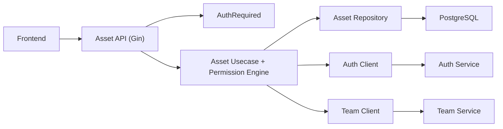

# Asset Management and Sharing Service

## Introduction

This service implements Stage 2 Service 1 domain logic:

- Folder and note CRUD
- Read/write sharing between users
- Inheritance of folder shares to notes
- Manager read-only oversight for assets owned by team members

It integrates with Auth service (identity/session validation) and Team service (relationship-based oversight checks).

## Tech Stack

- Go
- Gin
- GORM + PostgreSQL
- Auth client + Team client for service-to-service authorization context

## Requirements

- Go `1.24+` (module target: `1.26.2`)
- PostgreSQL database
- Auth service reachable at `AUTH_SERVICE_URL`
- Team service reachable at `TEAM_SERVICE_URL`
- Root `.env.backend`

## Project Structure

```text
asset-management-service/
├─ cmd/
│  └─ main.go
├─ config/
├─ internal/
│  ├─ domain/
│  ├─ repository/
│  ├─ usecase/
│  ├─ handler/
│  └─ middleware/
├─ docs/
│  ├─ docs.go
│  ├─ swagger.json
│  └─ swagger.yaml
├─ pkg/
│  └─ client/
├─ go.mod
└─ README.md
```

## Dependencies

Core dependencies from [go.mod](go.mod):

- `github.com/gin-gonic/gin`
- `gorm.io/gorm`
- `gorm.io/driver/postgres`
- `github.com/joho/godotenv`
- `github.com/swaggo/swag`, `github.com/swaggo/gin-swagger`, `github.com/swaggo/files`

## API Documentation

Base URL: `http://localhost:8082`  
Base path: `/api/v1`

### Swagger UI

`http://localhost:8082/swagger/index.html`

```powershell
swag init -g main.go -o docs --parseInternal -d ./cmd,./internal/handler,./internal/usecase
```

### Health

- `GET /health`

### Folder Endpoints

- `POST /folders`
- `GET /folders`
- `GET /folders/:folderId`
- `PATCH /folders/:folderId`
- `DELETE /folders/:folderId`

### Note Endpoints

- `POST /folders/:folderId/notes`
- `GET /folders/:folderId/notes`
- `GET /notes/:noteId`
- `PATCH /notes/:noteId`
- `DELETE /notes/:noteId`

### Sharing Endpoints

- `POST /shares`
- `DELETE /shares/:shareId`
- `GET /shares/received`
- `GET /shares/granted`

## Authorization Model

Permission checks are centralized in usecase logic:

- Owner has read/write access by default
- Direct share grants `read` or `write`
- Note access can be inherited from folder share
- Managers can read team member assets by oversight rule, but cannot write unless explicitly shared with write access

## Error Handling

- Usecase errors map to clear HTTP statuses (`400`, `403`, `404`, `500`).
- Permission denials return `403`.
- Missing resources return `404`.

## Architecture Overview



## Run and Development Guide

From this directory:

```powershell
go mod tidy
go run ./cmd/main.go
```

Run tests:

```powershell
go test ./...
```

## Environment

Required keys in root `.env.backend`:

- `DB_HOST`, `DB_PORT`, `DB_USER`, `DB_PASSWORD`, `DB_NAME`
- `ASSET_SERVICE_PORT` (default `8082`)
- `AUTH_SERVICE_URL` (default `http://localhost:8080`)
- `TEAM_SERVICE_URL` (default `http://localhost:8081`)

## Current Status

- Stage 2 Service 1 baseline is implemented and integrated with frontend.
- Sharing and inheritance behavior is implemented with centralized permission checks.
- Future improvements include test depth expansion and optimization paths for higher-volume authorization checks.
