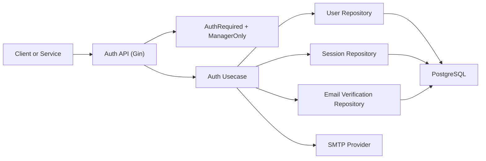

# Auth User Management Service

## Introduction

This service is the identity backbone of the project.  
It is responsible for user registration, email verification, authentication, session revocation, and role-aware user listing for manager workflows.

## Tech Stack

- Go
- Gin (HTTP routing and middleware)
- GORM + PostgreSQL
- JWT for access token transport
- SMTP-based email verification flow

## Requirements

- Go `1.24+` (module target: `1.26.2`)
- PostgreSQL running and reachable from `DB_*` variables
- Root `.env.backend` file
- Optional SMTP credentials for full registration verification flow

## Project Structure

```text
auth-user-management-service/
├─ cmd/
│  └─ main.go
├─ config/
├─ internal/
│  ├─ domain/
│  ├─ repository/
│  ├─ usecase/
│  ├─ handler/
│  └─ middleware/
├─ docs/
│  ├─ docs.go
│  ├─ swagger.json
│  └─ swagger.yaml
├─ pkg/
│  └─ utils/
├─ go.mod
└─ README.md
```

## Dependencies

Core dependencies from [go.mod](go.mod):

- `github.com/gin-gonic/gin`
- `gorm.io/gorm`
- `gorm.io/driver/postgres`
- `github.com/joho/godotenv`
- `github.com/golang-jwt/jwt/v5`
- `github.com/google/uuid`
- `github.com/swaggo/swag`, `github.com/swaggo/gin-swagger`, `github.com/swaggo/files`

## API Documentation

Base URL: `http://localhost:8080`  
Base path: `/api/v1`

### Swagger UI

Interactive OpenAPI (Swagger 2): `http://localhost:8080/swagger/index.html`  
Regenerate `docs/` after editing `// @Summary` / `@Router` comments on handlers:

```powershell
swag init -g main.go -o docs --parseInternal -d ./cmd,./internal/handler,./internal/usecase
```

### Health

- `GET /health`

### Auth Endpoints

- `POST /auth/register`
- `GET /auth/verify-email`
- `POST /auth/resend-verification`
- `POST /auth/login`
- `POST /auth/logout` (authenticated)

### User Endpoints

- `GET /users/me` (authenticated)
- `POST /users/bulk` (authenticated, internal cross-service lookup)
- `GET /users` (manager-only)
- `POST /import-users` (manager-only, multipart form field `file`, comma-separated CSV)

### Bulk import (`POST /import-users`)

- **CSV header (required columns):** `username`, `email`, `password`. Optional column: `role`. Column order may vary; unknown column names are rejected.
- **Delimiter:** comma. **Max upload size:** 3 MB.
- **Defaults:** empty or missing `role` becomes `member`. Imported accounts are created **email-verified** (`isVerified: true`).
- **Duplicates:** existing emails or duplicate emails within the same file are counted as failures (no upsert).
- **Concurrency:** worker pool size from environment variable `IMPORT_WORKERS` (default `5` if unset or invalid).
- **Response:** JSON with `success`, `failed`, `errors` (up to 50 row-level messages), and `errorsTruncated` when more than 50 errors occurred.

## Authorization Model

- Token parsing and session validity are enforced by auth middleware.
- `manager` role is required for `GET /users` and `POST /import-users`.
- `POST /users/bulk` is intentionally available to authenticated callers for internal service-to-service workflows (for example team/asset lookups).

## Error Handling

- Uses HTTP status semantics (`400`, `401`, `403`, `404`, `409`, `500`).
- Usecase-level typed errors are mapped in handlers for stable client-facing responses.

## Architecture Overview



## Run and Development Guide

From this directory:

```powershell
go mod tidy
go run ./cmd/main.go
```

Service port:

- `PORT` env value (default `8080`)

Run tests:

```powershell
go test ./...
```

## Environment

Main required keys in root `.env.backend`:

- `DB_HOST`, `DB_PORT`, `DB_USER`, `DB_PASSWORD`, `DB_NAME`
- `PORT`
- `APP_BASE_URL`
- `JWT_SECRET`, `JWT_EXPIRES_HOURS`
- `EMAIL_VERIFY_TOKEN_TTL_MINUTES`
- `IMPORT_WORKERS` (optional, positive integer; bulk CSV import worker pool size, default `5`)
- `SMTP_HOST`, `SMTP_PORT`, `SMTP_USERNAME`, `SMTP_PASSWORD`, `SMTP_FROM_EMAIL`, `SMTP_FROM_NAME`

## Current Status

- Stage 1 requirements for auth/user management are implemented.
- Service is actively used by Team and Asset services for token/user resolution.
- Bulk CSV user import (`POST /import-users`) for managers is implemented with a configurable worker pool.
