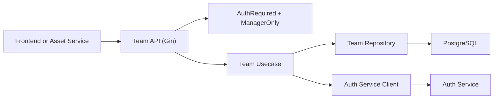

# Team Management Service

## Introduction

This service manages team domain logic for Stage 1:

- Team creation
- Member assignment/removal
- Manager assignment/removal within teams

It enforces role and team-scope restrictions while relying on Auth service for token validation and identity context.

## Tech Stack

- Go
- Gin
- GORM + PostgreSQL
- Environment loading with `godotenv`
- Auth-service HTTP client for identity/session validation

## Requirements

- Go `1.24+` (module target: `1.26.2`)
- PostgreSQL access through root backend env
- Auth service running and reachable
- Root `.env.backend`

## Project Structure

```text
team-management-service/
├─ cmd/
│  └─ main.go
├─ config/
├─ internal/
│  ├─ domain/
│  ├─ repository/
│  ├─ usecase/
│  ├─ handler/
│  └─ middleware/
├─ docs/
│  ├─ docs.go
│  ├─ swagger.json
│  └─ swagger.yaml
├─ pkg/
│  ├─ client/
│  └─ utils/
├─ go.mod
└─ README.md
```

## Dependencies

Core dependencies from [go.mod](go.mod):

- `github.com/gin-gonic/gin`
- `gorm.io/gorm`
- `gorm.io/driver/postgres`
- `github.com/joho/godotenv`
- `github.com/golang-jwt/jwt/v5` (token claims helpers)
- `github.com/swaggo/swag`, `github.com/swaggo/gin-swagger`, `github.com/swaggo/files`

## API Documentation

Base URL: `http://localhost:8081`  
Base path: `/api/v1`

### Swagger UI

`http://localhost:8081/swagger/index.html`

```powershell
swag init -g main.go -o docs --parseInternal -d ./cmd,./internal/handler,./internal/usecase
```

### Health

- `GET /health`

### Team Endpoints

- `GET /teams/my` (authenticated)
- `GET /teams/:teamId` (team member only)
- `POST /teams` (global manager only)
- `POST /teams/:teamId/members` (team manager only)
- `DELETE /teams/:teamId/members/:userId` (team manager only)
- `POST /teams/:teamId/managers` (main manager only)
- `DELETE /teams/:teamId/managers/:userId` (main manager only)

## Authorization Model

- All team routes require a valid bearer token.
- Global role `manager` is required for mutation routes.
- Additional team-level checks are enforced in usecase:
  - only team managers can manage members
  - only `mainManagerUserId` can manage other managers
- This service does not own global user records; it resolves identity via Auth service APIs.

## Error Handling

- Uses explicit usecase errors mapped to HTTP responses (`400`, `403`, `404`, `409`, `500`).
- Returns `403` for unauthorized team scope actions.
- Returns `404` when team or user references do not exist.

## Architecture Overview



## Run and Development Guide

From this directory:

```powershell
go mod tidy
go run ./cmd/main.go
```

Run tests:

```powershell
go test ./...
```

## Environment

Required keys in root `.env.backend`:

- `DB_HOST`, `DB_PORT`, `DB_USER`, `DB_PASSWORD`, `DB_NAME`
- `TEAM_SERVICE_PORT` (default `8081`)
- `AUTH_SERVICE_URL` (optional; defaults to `http://localhost:8080` in code path)

## Current Status

- Stage 1 team features are implemented and integrated with frontend.
- Service is used by asset workflows for manager-member relationship checks.
- Further expansion may include dedicated relationship-check endpoints for higher-scale authorization queries.

